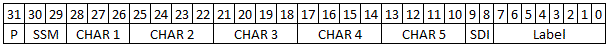

# Parameters XML File
This Custom Device can be configured using a scripting API or a Parameters XML File. This XML file defines the labels, parameters, and other settings necessary to populate a valid configuration in the System Definition. This document explains the schema used for creating a Parameters XML File, shows example sections for different encoding configurations, and outlines the defined tags.

## Schema Location
For the full schema file, see `ARINC429_Parameters_XML_Schema.xsd` in the same directory as this document.

## XML Parameters File Examples

### BNR Parameter Example
The code snippet below is an example of a BNR Parameter.

```xml
<label>
	<labelDecimal>23</labelDecimal>
	<createSDIChannel>false</createSDIChannel>
	<createSSMChannel>true</createSSMChannel>
	<createParityChannel>true</createParityChannel>
	<parameter>
		<encoding>BNR</encoding>
		<signed>true</signed>
		<startBit>10</startBit>
		<numberOfBits>19</numberOfBits>
		<scale>234.6</scale>
		<offset>-2.4</offset>
		<name>Parameter 0</name>
		<unit>psi</unit>
	</parameter>
</label>
```

Notes:
- The custom device engine takes 19 bits, starting the 11th bit (Bit #10) in the raw ARINC 429 word. As this is a signed BNR parameter, the left-most bit is the sign bit. The engine converts these 19 bits (2's complement) to decimal, multiplies by the <scale> value, and adds the <offset> value.
- This parameter will have a VeriStand Channel named `Parameter 0` with a unit of `psi`.

### BCD Parameter Example
The code snippet below is an example of BCD Parameters.

```xml
<channel>
	<hardwareChannel>26</hardwareChannel>
	<direction>outgoing</direction>
	<speed>high</speed>
	<label>
		<labelDecimal>28</labelDecimal>
		<transferType>0</transferType>
		<period>10000</period>
		<parameter>
			<encoding>BCD</encoding>
			<signed>true</signed>
			<startBit>18</startBit>
			<numberOfBits>11</numberOfBits>
			<scale>1.0</scale>
			<offset>0.0</offset>
			<name>Parameter 5</name>
			<unit>psi</unit>
			<defaultValue>-724</defaultValue>
		</parameter>
		<parameter>
			<encoding>BCD</encoding>
			<signed>false</signed>
			<startBit>10</startBit>
			<numberOfBits>8</numberOfBits>
			<scale>1.0</scale>
			<offset>0.0</offset>
			<name>Parameter 16</name>
			<unit>psi</unit>
			<defaultValue>25</defaultValue>
		</parameter>
	</label>
<channel>
```

Notes:
- These are parameters definitions for a Tx Channel as <defaultValue> element is present and <hardwareChannel> element is in [16:31] range.
- Below is the breakdown of `<labelDecimal>` 28 with individual label bits and BCD Digits (top row represents bit indexes):

- This parameter will have a VeriStand Channel named `Parameter 5` with a unit of `psi`. 
- For parameter `Parameter 5`, SSM Bits (bits [29:30]) are used for the sign; it is considered negative if SSM Bits are 11b (0x3). For all other SSM Bits values, BCD is considered to be positive. Bits [18:28] are 3 digits (`CHAR 1`, `CHAR 2`, and `CHAR 3`). As no scaling is applied, the value can vary in range: [-799:799]. The left-most digit `CHAR 1` has only 3 bits width.
- For parameter `Parameter 16`, bits [10:17] are 2 digits (`CHAR 4` and `CHAR 5`). As no scaling is applied, value can vary in range: [0:99].

### Discrete Parameter Example
The code snippet below is an example of Discrete Parameters.

```xml
<label>
	<labelDecimal>23</labelDecimal>
	<transferType>0</transferType>
	<period>20000</period>
	<parameter>
		<encoding>Discrete</encoding>
		<startBit>10</startBit>
		<numberOfBits>1</numberOfBits>
		<name>Parameter 30</name>
	</parameter>
</label>
```

Notes:
- The custom device engine takes 1 bit, starting with the 11th bit (Bit #10) in the raw ARINC 429 word. No scaling is applied.
- This parameter will have a VeriStand Channel named `Parameter 30` with no units.

## Supported XML Tags
The following table describes the XML elements, or tags, you can use in a Parameters XML file.

|Element|Required?|Element Type|Min/Max Occurrences|Description|
|--- |--- |--- |--- |--- |
|`<channel>`|Yes|complex|1/16|Opening tag for a channel labels definition.|
|→`<hardwareChannel>`|Yes|xs:int|1|Specifies the Hardware Channel used. Range is: [0:31].|
|→`<direction>`|Yes|xs:string|1|Specifies whether the channel is incoming (Rx) or outgoing (Tx).|
|→`<speed>`|No|xs:string|0/1|Specifies the transfer rate of the channel. Supported values:<br/>low - 12.5 kHz<br/>high - 100 kHz (default)|
|→`<label>`|Yes|complex|1/256|Opening tag for a label definition..|
|→→`<labelDecimal>`|No<sup>1</sup>|xs:int|0/1|Specifies the label (decimal). Range is: [0:255].|
|→→`<labelOctal>`|No<sup>1</sup>|xs:int|0/1|Specifies the label (octal). Range is: [0:377].|
|→→`<sdi>`|No|xs:string|0/1|Specifies whether these Label settings apply to all SDI variants or a specific one. Supported values: <br/>All (default) - Pastes by creating a new instance of the item.<br/>00 - Pastes only if an item with the same GUID does not already exist.<br/>01 - Pastes only if an item with the same name does not already exist.<br/>10 - Pastes by replacing an item.<br/>11 - Prompts the operator with a dialog before pasting.|
|→→`<transferType>`|No|xs:int|0/1|Specifies the transfer type for a Tx message. Use 0 for a scheduled label; use 1 for an acyclic label. Default Value (if XML element is absent) is 0 (Scheduled).|
|→→`<period>`|No|xs:int|0/1|Specifies the period, in microseconds, for a scheduled Tx label. Default Value (if XML element is absent) is 1000.|
|→→`<createTimestampChannel>`|No|xs:boolean|0/1|Specifies whether a VeriStand Channel should be created for the label timestamp. This property is supported only for a receive (Rx) label, not for a transmit (Tx) label. Default Value (if XML element is absent) is false.|
|→→`<createSDIChannel>`|No|xs:boolean|0/1|Specifies whether a VeriStand Channel should be created for the Label SDI Bits. Default Value (if XML element is absent) is false.|
|→→`<createSSMChannel>`|No|xs:boolean|0/1|Specifies whether a VeriStand Channel should be created for the Label SSM Bits. Default Value (if XML element is absent) is false.|
|→→`<createParityChannel>`|No|xs:boolean|0/1|Specifies whether a VeriStand Channel should be created for the Label Parity Bit. This property is supported only for a receive (Rx) label, not for a transmit (Tx) label. Default Value (if XML element is absent) is false.|
|→→`<parameter>`|No|complex|1/unbounded|Opening tag for a Parameter definition.|
|→→→`<encoding>`|Yes|xs:string|1/1|Specifies the Encoding for the Parameter. Supported values:<br/>BNR (default) - Binary Number Representation.<br/>BCD - Binary Coded Decimal. Each decimal digit is represented by a fixed number of bits.<br/>Discrete - Set of individual adjacent bits.|
|→→→`<signed>`|No|xs:boolean|0/1|Specifies whether Parameter is signed. It applies only to BCD and BNR encoding. If it is a signed BCD Parameter,it is considered negative if SSM Bits are 11. For all other cases, the BCD is considered to be positive.|
|→→→`<startBit>`|Yes|xs:int|1/1|Specifies the Start Bit for the Parameter. It is a 0-based information. For Labels from Rx Channels, range accepted is: [0:31]. For Labels from Tx Channels, valid range is: [8:30] (Label ID (bits [0:7] and Parity Bit (bit 31) are overloaded by board firmware). For Parameters when `<encoding>` is set to BCD, `<startBit>` values supported are: 8..30.|
|→→→`<numberOfBits>`|Yes|xs:int|1/1|Specifies the number of bits for the Parameter. Range accepted is: [0:32].|
|→→→`<scale>`|No|xs:double|0/1|Specifies the Scale value to be applied to scale to and from the raw data. If no scaling is to be applied, value should be set to 1.0.|
|→→→`<offset>`|No|xs:double|0/1|Specifies the Offset value to be applied to offset to and from the raw data. If no offset is to be applied, value should be set to 0.0.|
|→→→`<name>`|Yes|xs:string|1/32|Specifies, for each Parameter, the name to be used in VeriStand. When Parameter encoding is set to Discrete, each Parameter (each bit) must have an instance of that `<name>`.|
|→→→`<unit>`|No|xs:string|0/1|Specifies, for each Parameter, the unit to be used in VeriStand.|
|→→→`<defaultValue>`|No<sup>2</sup>|xs:double|0/unbounded|Specifies, for each Parameter, the Default Value to be used for the associated VeriStand Channel. For Parameters used in Tx Channels, this XML Element must be present for each Parameter. For Parameters used in Tx Channels, when Parameter `<encoding>` is set to Discrete, each Parameter (each bit) must have an instance of that `<defaultValue>`.|

Notes:
1. Either `<labelDecimal>` or `<labelOctal>` must be present for each `<label>` instance.
2. For Parameters used in Tx Channels, `<defaultValue>` must be present for each Parameter.
