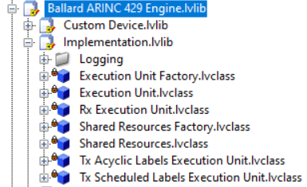
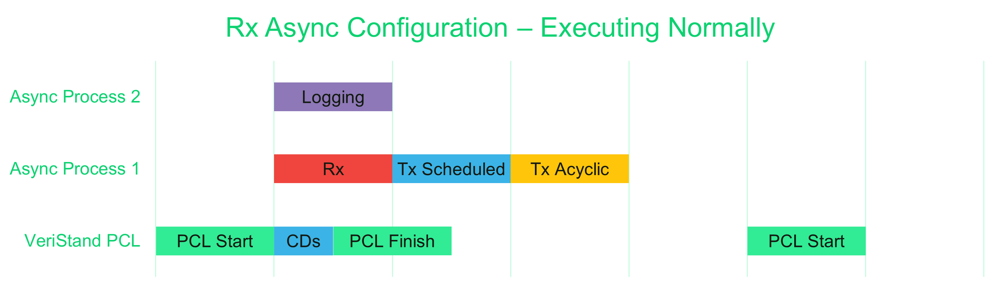

# Theory of Operations

This guide details low-level custom device implementation details of the AIM ARINC 429 custom device and their impact on system performance.

## Communications Bus Template

This custom device is based on the [VeriStand Communications Bus Template](https://github.com/ni/niveristand-communications-bus-template). That project's User Guide contains its own [Theory of Operation section](https://github.com/ni/niveristand-communications-bus-template/blob/main/Docs/User%20Guide.md#theory-of-operation), which details the main components of custom devices implemented based on this pattern. This guide explains the design decisions and performance implications for this custom device.

The most important concept in the Communications Bus Template's design pattern is the ability to execute individual engine components as either inline or asynchronous processes from the same inline custom device. This is detailed in the [Engine section](https://github.com/ni/niveristand-communications-bus-template/blob/main/Docs/User%20Guide.md#engine) of that User Guide.

## Execution Units

This custom device consists of several Execution Units and Factories, and this section details the execution mode and responsibilities of each.

| Execution Unit | Mode | Responsibility |
| --- | --- | --- |
| Rx Execution Unit | **Inline**, Async Group 1 | Read all incoming 429 label buffers defined in the configuration file |
| Tx Scheduled Execution Unit | Async Group 1 | Write all outgoing, scheduled 429 label buffers defined in the configuration file |
| Tx Acyclic Execution Unit | Async Group 1 | Write all outgoing, acyclic 429 label buffers defined in the configuration file and trigger their transmission |
| Logging Execution Unit | Async Group 2 | If enabled, read all labels on the channels configured in the configuration file |

**Note**: The bolded execution mode is default if the execution mode is configurable.

### Execution Unit Factory

This Factory is included in the Engine library but executes on the host PC during deployment of the custom device. Each Execution Unit's data is retrieved from the System Definition, channel references are configured, and the execution mode of each is determined. The output of `Create Execution Unit.vi` is deployed to the target and un-flattened in the RT Engine.

## Execution Modes

As shown above, the default configuration of the custom device executes all Execution Units except for Rx as asynchronous. Rx is inlined by default, which means the Rx Execution Unit's `Read from Hardware.vi` is called inline within VeriStand's Primary Control Loop (PCL). 

The Rx Execution Unit's execution duration increases linearly with the number of ARINC 429 labels configured in the Parameters configuration file. If left to execute inline within the PCL, reading many labels will limit the maximum HP loop rate of the entire VeriStand deployment.

This section shows different execution modes that are user configurable to maximize the system performance while maintaining deterministic reading and writing of ARINC 429 labels. Note that all plots are oversimplified to demonstrate the effect of the execution modes. The execution time for each Execution Unit and the PCL will vary greatly depending on the system complexity, processor capability, and the number of labels exposed in the configuration file.

### Default Configuration: Rx Executes Inline

The plot below shows an ideal execution model where:
- the Rx Execution Unit is executed inline with the PCL and finishes in time
- the Tx Execution Units are executed async
- Logging is enabled and executed async

As long as the rest of the VeriStand system meets timing constraints (the PCL does not run late), this is an acceptable execution mode. However, depending on the number of labels configured and the desired PCL loop rate, the Rx Execution Unit can cause the PCL to run late.

When the PCL runs late, VeriStand will report that the actual loop rate is lower than the configured loop rate, and late high priority (HP) loop counts will be recorded. The plot below shows the scenario where the Rx Execution Unit taking a long time to execute causes the next iteration of the PCL to not start at the desired time.

### Rx Configured as Asynchronous

In order to maximize the performance of the rest of the system, the Execution Unit and Factory design pattern allows simple modification of the execution mode of each execution unit. This custom device has a configuration option to run the Rx Execution Unit as Asynchronous. When selected, the Rx Execution unit executes in Async Group 1.

This configuration is advantageous when trying to free up high-priority CPU time to maintain PCL stability. The plot below shows the change in execution mode.

This is also advantageous when the Rx Execution Unit takes longer than the desired PCL period to execute. If the custom device's Execution Unit does not complete before the next PCL iteration, the rate will effectively be decimated, and the next iteration of this custom device instance will be skipped.

### Decimated Execution

To maintain deterministic execution rates of the custom device with large label counts, it is recommended to both make the Rx execution asynchronous and decimate the custom device execution. Decimation allows the user to specify the number of PCL iterations between iterations of the custom device.

The plot below shows a similar situation to the late-execution asynchronous Rx execution from above. The custom device will not cause the PCL to run late, but due to variability in execution times, the custom device loop rate may vary over time. However, if the custom device is decimated to run every two PCL iterations, the loop rate of the custom device can be made more deterministic.

## Using Timing Channels to Analyze Performance

Users can monitor the optional Timing Channels to analyze the impact of the custom device on system performance. Right-click on the custom device in System Explorer to add these **Timing Channels**. 

These channels are updated each iteration of the custom device. The values represent the time in microseconds used to execute `Write to Hardware.vi` and `Read from Hardware.vi` for the corresponding execution unit. Depending on the custom device configuration, the `Rx Execution Time` channel is either the time spent executing inline within the PCL or asynchronously in the first execution unit group.

The maximum achievable VeriStand loop rate can be calculated once the worst-case values for these execution durations is recorded. For example, an inline Rx custom device that takes 500us to execute will never execute faster than 2000Hz without late counts.
