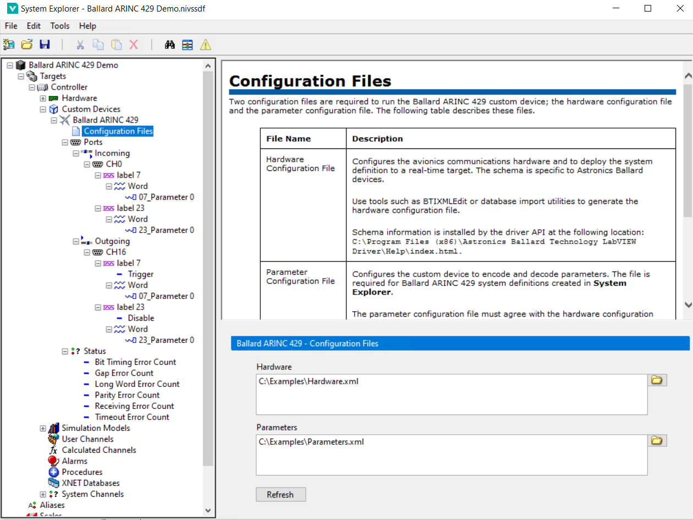
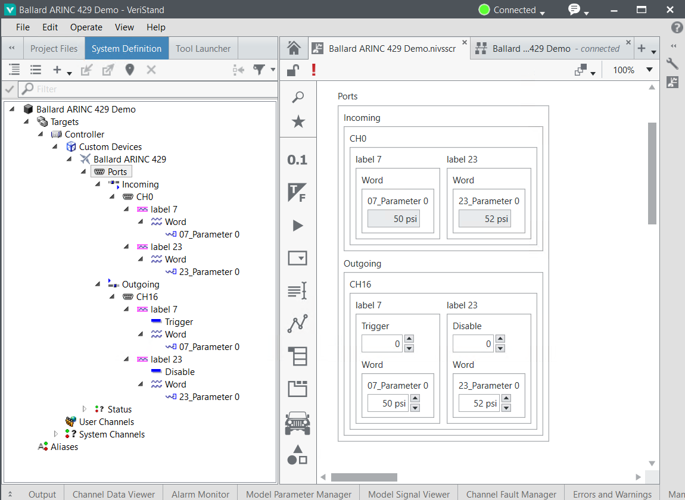

# Using the Ballard ARINC 429 Custom Device

This guide demonstrates how to configure and deploy the Ballard ARINC 429 custom device. Using the receive/transmit channels on the first pin pair of the Ballard ARINC 429 PXI module, it is possible to use the custom device to send and receive data without external wiring.

## Configure the Ballard ARINC 429 Hardware

The custom device targets one **core** of a Ballard ARINC 429 PXI module. To target multiple modules or multiple cores on the same module, you must use multiple instances of the custom device.

A valid hardware configuration for the core must be provided to each instance of the custom device. The hardware configuration is provided by an XML file that adheres to Ballard's schema, referred to here as the `Hardware XML` file. Ballard's driver includes the `BTI XML Editor` application to generate valid hardware configurations.


A simple Hardware XML file is included for getting started with the custom device.

## Configure the Custom Device

This guide shows two options for configuring the custom device:
- Importing a Parameters file in System Explorer
- Scripting the custom device configuration

### Importing a Parameters file in System Explorer
The Parameters file is generated from an XML schema for configuring the custom device. It must match the Hardware XML file's configuration for the Ballard hardware. More information about the Parameters file XML schema can be found in `Docs/Parameters XML File/Parameters XML File.md`.

This example uses simple example Parameters and Hardware files found in the `Assets` directory:
- `Assets/Parameters.xml`
- `Assets/Hardware.xml`

The files are configured with two ARINC 429 channels each containing the same two labels. The following XML snippet shows the Parameters file configuration of the transmit channel: Label 07 is an acyclic label with one BNR parameter, and Label 23 is a cyclic label with one BNR parameter. The receive channel contains two labels configured identically.

```
	<channel>
		<hardwareChannel>16</hardwareChannel>
		<direction>outgoing</direction>
		<label>
			<labelDecimal>07</labelDecimal>
			<transferType>1</transferType>
			<parameter>
				<encoding>BNR</encoding>
				<signed>true</signed>
				<startBit>10</startBit>
				<numberOfBits>19</numberOfBits>
				<scale>1.0</scale>
				<offset>0.0</offset>
				<name>07_Parameter 0</name>
				<unit>psi</unit>
				<defaultValue>50.0</defaultValue>
			</parameter>
		</label>
		<label>
			<labelDecimal>23</labelDecimal>
			<transferType>0</transferType>
			<parameter>
				<encoding>BNR</encoding>
				<signed>true</signed>
				<startBit>10</startBit>
				<numberOfBits>19</numberOfBits>
				<scale>1.0</scale>
				<offset>0.0</offset>
				<name>23_Parameter 0</name>
				<unit>psi</unit>
				<defaultValue>52.0</defaultValue>
			</parameter>
		</label>
	</channel>
```

Transmit channel 16 will loop back without external wiring to receive channel 0. This is based on the [send and receive pairs](https://www.ni.com/pdf/manuals/MA223_OmniBus%20II%20NI%20PXIe%20User%20Manual_C.1.pdf#page=50) of the channel layouts for the Ballard ARINC 429 hardware.

#### Configure the Custom Device in System Explorer

1. Create a new VeriStand Project and configure your PXI Linux RT target.
2. Navigate to the `Targets\Controller\Hardware\Custom Devices` entry in the tree.
3. Right-click the **Custom Devices** entry and add a new instance of the **National Instruments\Ballard ARINC 429** custom device.
4. Use the Main Page to set the **PXI Slot Number** and **Core Number** accordingly.

5. Navigate to the **Configuration Files** page.
6. Use the browse button next to each box to select the example files used for this example.
   1. Hardware file: `niveristand-ballard-arinc429-custom-device\Docs\User Guide\Assets\Hardware.xml`
   2. Parameters file: `niveristand-ballard-arinc429-custom-device\Docs\User Guide\Assets\Parameters.xml`


Note: After configuring the custom device, all of the configuration under `Ports` is read-only except for the `Description` field on each page.


#### Scripting the Custom Device Configuration

The Ballard ARINC 429 custom device includes a LabVIEW scripting API to configure the custom device programmatically. This allows users to parse an existing ARINC 429 database into a working custom device configuration without the need to create a Parameters file. It also allows importing a Parameters file programmatically instead of through System Explorer.

To use the scripting API, the optional scripting package must be installed:
`ni-ballard-arinc-429-veristand-20xx-labview-support`

The scripting API includes two example files inside a LabVIEW example project found at the following directory: `C:\Program Files (x86)\National Instruments\LabVIEW 20xx\examples\NI VeriStand Custom Devices\Ballard\ARINC 429\Support`. It contains two example VIs:

- `Import Parameters Configuration to New Ballard ARINC 429 Custom Device.vi` - Demonstrates using the Ballard ARINC 429 scripting API to configure the custom device by importing a parameters configuration file.
- `Build New Ballard ARINC 429 Custom Device.vi` - Demonstrates using the Ballard ARINC 429 scripting API to configure the custom device by building from configuration clusters.


### Deploy the System Definition

After configuring the System Definition with the custom device, deploy the System Definition using VeriStand. Once the deployment state reaches **Connected**, use a VeriStand screen to display the custom device inputs and outputs. This example uses VeriStand 2020 R5, so your screen controls may behave differently depending on version.

1. Open a VeriStand Screen
2. Highlight the **System Definition** tree in the left rail
3. Expand the tree to `Targets\Controller\Hardware\Custom Devices\Ballard ARINC 429\Ports`
4. Drag the **Ports** item onto the screen
5. Change the values written to the outgoing channel 16 (**07_Parameter 0** and **23_Parameter 0**)
6. Toggle the **Trigger** and **Disable** VeriStand channels under each label to see the behavior reflected to the incoming channels



### Modifying the Custom Device Configuration

Once the custom device is configured, you can change the configuration using the **Configuration Files** page in System Explorer. If the Parameters file changes on disk, use the **Refresh** button. If you need to select a new file, press the button to load a new path into the dialog.

Each time the configuration is changed, the **Ballard ARINC 429 Refresh** dialog will be displayed to compare the current and new configurations. Press **Apply** to accept the changes, or **Cancel** to exit without reconfiguring.

